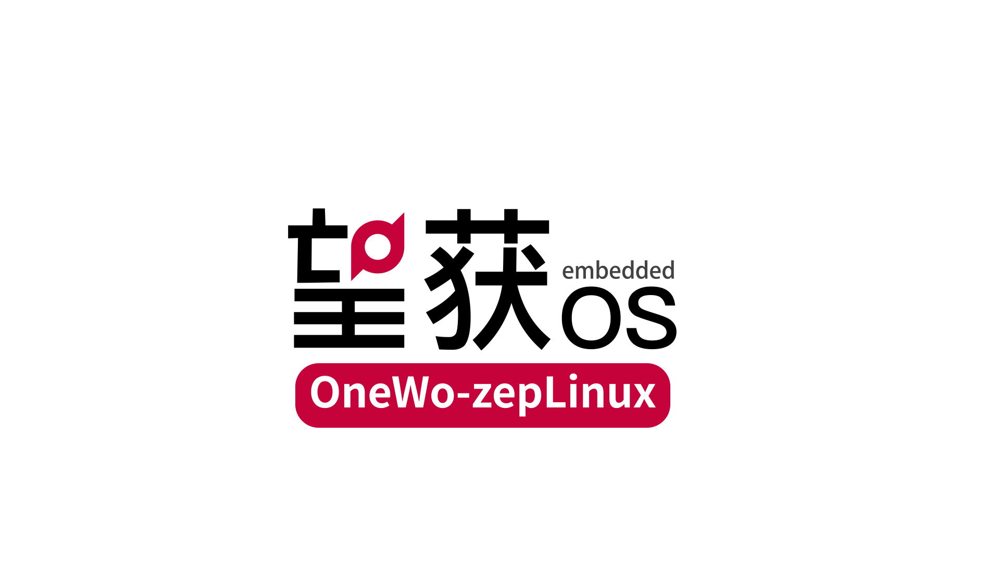

# 从单片机实践走向系统开发：Rocket-Pi 加入望获 zepLinux 生态

{ width="800" style="display: block; width: 100%; max-width: 800px; height: auto; margin: 1.5rem auto; background: #fff;" }

图片来源：[望获 OS 官网](https://www.onewos.com/)。

**Rocket-Pi 已成为望获 zepLinux 官方适配开发板！**

在望获 OS 官网的 zepLinux 产品页面中，**STM32F401RE、Rocket-Pi** 已列入支持开发板清单，并附有 Rocket-Pi 官网入口。这让 Rocket-Pi 的系统开发实践多了一条值得探索的路线。适配信息可在[望获 zepLinux 官方产品页面](https://www.onewos.com/product/zeplinux)查看。

我们也以这则消息作为「生态支持」栏目的第一篇文章，记录 Rocket-Pi 与操作系统、开源项目及开发工具之间的连接，帮助大家找到更多可以动手实践的方向。

## 认识望获 zepLinux

望获 zepLinux（OneWo-zepLinux）基于 Zephyr RTOS 深度定制，面向资源受限的微控制器平台，提供 Linux API 兼容层，将 MCU 实时系统开发与 Linux 生态应用迁移联系起来。其核心代码已开源，官方提供 GitHub 和 Gitee 仓库入口。详见[官方产品介绍](https://www.onewos.com/product/zeplinux)。

理解这条技术路线时，需要区分 **Linux API 兼容能力**与**完整 Linux 发行版**：评估一个应用能否迁移，应检查它依赖的接口、库、内存和外设条件，并结合所用版本进行验证。

## 对 Rocket-Pi 开发者意味着什么

学习单片机时，我们常从点亮 LED、串口收发和传感器读取开始。随着功能增加，问题也会逐渐变成：多个任务怎样协作？共享资源怎样保护？驱动与业务逻辑怎样分开？现有代码怎样迁移到新的系统环境？

有了新的系统适配入口，同一块 Rocket-Pi 可以承载更多层次的学习实践：

- **从外设控制走向任务协作**：选择自己熟悉的 LED 或串口功能，尝试用任务、同步和消息传递组织程序。
- **从完成一个例程走向理解系统结构**：关注板级配置、驱动接口与应用代码之间的关系，理解一个功能如何从硬件连接到系统服务。
- **从编写新代码走向评估代码复用**：挑选依赖简单的小模块，梳理它使用的 API，再逐项验证迁移条件。

这些都可以作为后续实验选题。熟悉的硬件现象能够帮助我们判断程序是否正常运行，把更多注意力放在系统开发方法上。

## 从哪里开始

建议先确认自己的开发板型号与版本，再按照官方仓库当前说明准备开发环境、选择对应板级配置并完成构建与烧录。首次实践可以从最小示例开始，确认启动与日志输出正常后，再逐步加入应用功能。

| 资源 | 用途 |
| --- | --- |
| [望获 zepLinux 官方介绍](https://www.onewos.com/product/zeplinux) | 查看产品定位、支持开发板及官方资源入口 |
| [官方 GitHub 仓库](https://github.com/ucas-linux/OneWo-zepLinux) | 获取源码，查阅当前版本说明与开发资料 |
| [官方 Gitee 仓库](https://gitee.com/ucasucas/OneWo-zepLinux) | 通过 Gitee 获取项目源码与说明 |
| [Rocket-Pi 硬件一览](../roadmap/hardware.md) | 熟悉开发板硬件与接口 |
| [Rocket-Pi 学习路线](../roadmap/roadmap.md) | 回顾开发环境与单片机基础知识 |
| [Rocket-Pi Zephyr 专栏](../zephyr/zephyr.md) | 学习本站已有的 Zephyr 相关内容 |

!!! note "适配范围以所用版本为准"
    官方支持开发板不等于所有板载外设、扩展模块和本站示例都已在 zepLinux 下验证。具体驱动支持、API 兼容范围及构建方式，请以 zepLinux 对应版本的文档和板级配置为准；本站 Zephyr 示例可作为学习参考，迁移时仍需逐项验证。

## 感谢望获 OS 团队，让系统实践多一个起点

**感谢望获 OS 团队对 Rocket-Pi 的适配与支持，也感谢团队将 zepLinux 核心代码开放给开发者。** 从板级适配到系统与硬件之间的衔接，这些工作为社区提供了可以继续学习、验证和扩展的基础。

对于正在学习嵌入式开发的朋友，一块熟悉的开发板能够进入新的操作系统生态，就多了一次把已有知识与新方法联系起来的机会。感谢望获 OS 团队为这条学习路径增加新的入口，让大家有机会围绕 Rocket-Pi 探索更多系统开发实践。

如果 zepLinux 对你有帮助，欢迎前往[官方开源仓库](https://github.com/ucas-linux/OneWo-zepLinux)为项目点一个 Star，通过问题反馈、文档补充或代码贡献参与共建。分享实践成果时，也请保留项目来源与贡献者署名，让这些工作被更多人看见。

## 一块开发板，继续拓展实践空间

Rocket-Pi 希望让开发者沿着可复现、可理解的例程逐步成长。加入望获 zepLinux 生态，为这条学习路径增加了新的系统实践入口，也提供了从 MCU 外设开发进一步探索应用迁移的机会。

欢迎大家基于 Rocket-Pi 尝试 zepLinux，分享环境搭建记录、移植过程与调试心得。遇到问题时，记录系统版本、板卡信息、复现步骤和日志，会让交流与定位更高效。

从一个熟悉的小实验出发，继续探索这块开发板的更多可能。
